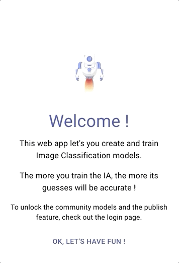

# ClassifAi Live
ClassifAi Live is an open-source __Image Classifier IA web app__ project, made for __Arweave's open web hackathon__.

<kbd></kbd>

## Progressive Web App and Offline
This is a __[Progressive Web App](https://en.wikipedia.org/wiki/Progressive_web_application)__, meaning that it has everything needed to be [installed](https://support.google.com/chrome/answer/9658361?co=GENIE.Platform%3DDesktop&hl=en&oco=1) and used as a "normal app" on your device, if installed __ClassifAi Live__ will work even if you're __offline__ !

## What can ClassifAi Live do ?
It can recognizes images and classify them into different categories.

<kbd></kbd>

## How does it work ?
Users create "models" with at least two categories and then "train" ClassifyAi to recognize these categories by feeding it images from the camera.
Moreover logged in users with an Arweave's keyfile can share their models with the community or use a model made by the community.

## How to use ClassifAi Live
ClassifAi Live works on both computers and mobile devices, it required access to the camera.

### The Main Features
* Use the Example model or create a new one with at least two categories
* Give access to the camera when asked
* Train ClassifAi Live by clicking on the categories buttons, this tells it that the current image belongs to that category
* The more ClassifAi Live is trained, the more its guess will be accurate !

### The Publish and Community features
* Go to the account page by clicking the "person" icon on the home page
* Drop your arweave's keyfile in the drop zone to log in
* You know have access to the community models and to the publish feature

The publishing process may take some time to be fully completed, the published model will only be usable after the process is fully done (from a few minutes to hours depending on the level of training of the model).

<kbd></kbd>
<kbd></kbd>

## Technologies
The main technologies and frameworks used in this project are :
* [React](https://reactjs.org/) / [Redux](https://redux.js.org/)
* [Material-ui](https://material-ui.com/)
* [TensorFlow.js](https://www.tensorflow.org/) (A library from Google for __Machine Learning__ in JavaScript)
* [Arweave](https://www.arweave.org/) (A __blockchain__ based network and permanent storage system)

## Installing and running ClassifAi locally
Installing :
```
yarn
```
Running : 
```
yarn start
```
Building : 
```
yarn build
```
